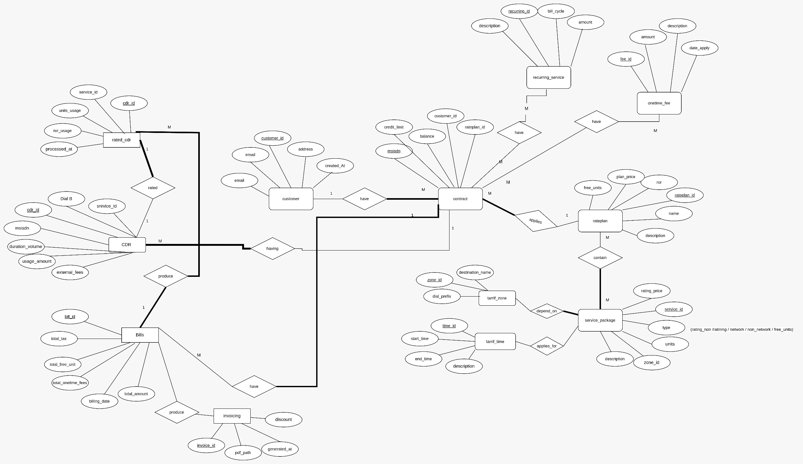

# 📡 Telecom Billing System — NextGen


> A production-grade telecom mediation and billing platform implementing the complete billing lifecycle — from CDR ingestion through mediation, real-time rating, invoice generation, and a modern web dashboard.

---

## 🏗️ Architecture Overview

```
┌──────────────────────────────────────────────────────────────┐
│  CLIENT LAYER          Next.js 16 · React 19 · Tailwind CSS  │
│  Login · Subscriber Dashboard · Administrator Panel          │
└──────────────────────────┬───────────────────────────────────┘
                           │ HTTP
┌──────────────────────────▼───────────────────────────────────┐
│  API GATEWAY LAYER       Next.js API Routes (proxy)          │
│  /api/auth · /api/customer/* · /api/contract · /api/profiles │
└──────────────────────────┬───────────────────────────────────┘
                           │ HTTP → Tomcat
┌──────────────────────────▼───────────────────────────────────┐
│  APPLICATION LAYER       Jakarta EE 10 · Tomcat              │
│  AuthServlet · ProfileServlet · CustomerServlet · Contract   │
└──────────────────────────┬───────────────────────────────────┘
                           │ JDBC
┌──────────────────────────▼───────────────────────────────────┐
│  PROCESSING LAYER        ETL Pipeline                        │
│  CDR Generator (Python) → Parser (Java) → Rating (Java 21)  │
│                       → Aggregation / Invoice (Java 25)      │
└──────────────────────────┬───────────────────────────────────┘
                           │ JDBC
┌──────────────────────────▼───────────────────────────────────┐
│  DATA LAYER              PostgreSQL (Neon Cloud)             │
└──────────────────────────────────────────────────────────────┘
```

---

## ✨ Key Features

- **End-to-end CDR pipeline** — generates, parses, rates, and invoices telecom usage records automatically
- **Three-tier rating logic** — free units → service-specific units → monetary ROR charging
- **Real-time mediation** — Java parser polls for new CDR files every 5 seconds and batch-inserts to DB
- **PDF invoice generation** — automated invoice creation using openhtmltopdf with 10% tax calculation
- **Zone-based pricing** — tariff zone resolution for international call pricing with in-memory cache
- **Modern dashboard** — Next.js 16 subscriber portal with Framer Motion animations and toast notifications
- **Session-based auth** — JSESSIONID cookie forwarded via Next.js proxy with path rewriting

---

## 🔄 Billing Pipeline

```
Subscriber Activity (Voice / SMS / Data)
         │
         ▼
  CDR Generator ──────── Python · 100 CDRs/batch · every 5s
         │ CSV files
         ▼
  Mediation / Parser ──── Java · field extraction · timestamp reconstruction
         │ INSERT INTO cdr
         ▼
  PostgreSQL ──────────── unprocessed CDR queue
         │ polls every 5s
         ▼
  Rating Engine ──────── Step 1: free units → Step 2: service units → Step 3: ROR
         │ INSERT rated_cdr · UPDATE customer_profile
         ▼
  Aggregation Engine ─── subtotal + recurring + one-time + 10% tax · PDF output
         │ INSERT invoice
         ▼
  Web Dashboard ──────── /profile · /invoices · /contract · /rateplans
```

---

## 📊 Rating Algorithm

The rating engine applies a **three-step waterfall** for each CDR:

| Step | Pool | Action |
|------|------|--------|
| 1 | Free units (general) | Deduct shared monthly allowance first |
| 2 | Service-specific units | Voice minutes / SMS count / Data MB |
| 3 | ROR (Running on Rate) | `remaining_usage × price_per_unit → monetary charge` |

This mirrors real-world prepaid/postpaid telecom billing logic.

---

## 🗄️ Database Schema (Key Tables)

| Table | Purpose |
|-------|---------|
| `customer` | Master customer record (email PK) |
| `contract` | MSISDN ↔ customer ↔ rateplan binding |
| `customer_profile` | Live usage counters per MSISDN |
| `cdr` | Raw call detail records |
| `rated_cdr` | Processed records with charge breakdown |
| `invoice` | Monthly invoices with PDF path |
| `rateplan` | Pricing plans with free unit allowances |

```
customer (1) ──→ (∞) contract
contract  (1) ──→ (1) customer_profile
contract  (1) ──→ (∞) cdr
cdr       (1) ──→ (1) rated_cdr
contract  (1) ──→ (∞) invoice
rateplan  (1) ──→ (∞) contract
```

---

## 🚀 Quick Start

### Prerequisites
- Java 11+ (Tomcat backend), Java 21+ (Rating Engine), Java 25 (Aggregation)
- Python 3.x
- Maven 3.8+
- Node.js 18+
- PostgreSQL connection string (Neon Cloud recommended)

### Run the Full Stack

```bash
# Clone the repository
git clone https://github.com/YOUR_USERNAME/TelecomBillingSystem-NextGen.git
cd TelecomBillingSystem-NextGen

# Configure database connection
# Edit DataBaseConnect.java with your PostgreSQL credentials

# Run everything with the orchestration script
chmod +x Billing_System.sh
./Billing_System.sh
```

The script will:
1. Compile and deploy the WAR to Tomcat
2. Start the Python CDR generator
3. Start the Java mediation parser
4. Start the Rating Engine
5. Start the Aggregation Engine
6. Start the Next.js frontend on port 3000

### Service Startup Order

```
[0] mvn clean package → TelecomBillingWebsite.war → Tomcat
[1] python3 generate_cdrs.py &
[2] mvn exec:java (Parser) &
[3] mvn exec:java (Rating Engine) &
[4] mvn exec:java (Aggregation Engine) &
[5] npm run dev (Next.js) &
```

---

## 📁 Project Structure

```
TelecomBillingSystem-NextGen/
│
├── Billing_System.sh            # Orchestration entry point
│
├── frontend/telecom-next/       # Next.js 16 web application
│   ├── app/login/               # Authentication page
│   ├── app/user/                # Subscriber dashboard
│   ├── app/admin/               # Administrator panel
│   └── components/              # Reusable UI components
│
├── TelecomBillingWebsite/       # Java/Tomcat REST backend (WAR)
│   └── src/main/java/com/iti/
│       ├── servlet/             # AuthServlet, CustomerServlet, etc.
│       ├── dao/                 # Database access objects
│       └── model/               # Domain models
│
├── parser_module/               # CDR generator + Java parser
│   ├── generate_cdrs.py         # Python CDR simulator
│   └── TelecomBillingParser.java
│
├── ratingEngine/                # Real-time rating engine
│   └── src/main/java/
│       ├── RatingEngine.java    # Main orchestrator
│       ├── ZoneResolver.java    # Tariff zone pricing
│       └── CdrHandling.java     # CDR data access
│
└── AggregationEngine/           # Invoice generation
    └── src/main/java/
        ├── AggregationEngine.java
        ├── InvoiceService.java  # Core billing logic
        └── pdfService.java      # openhtmltopdf output
```

---

## 🌐 API Reference

| Method | Endpoint | Description |
|--------|----------|-------------|
| `POST` | `/api/auth` | Login — returns JSESSIONID |
| `GET` | `/api/auth` | Check session status |
| `GET` | `/api/customer/profile?email=X` | Subscriber usage profile |
| `GET` | `/api/customer/invoices?email=X` | Billing history |
| `GET` | `/api/profiles/rateplans` | Available pricing plans |
| `GET` | `/api/profiles/services` | Service package definitions |
| `GET` | `/api/profiles/fees` | Recurring and one-time fees |
| `GET/PUT` | `/api/contract` | Contract management |

---

## 🛣️ Roadmap

| Enhancement | Technology | Benefit |
|-------------|-----------|---------|
| CDR streaming | Apache Kafka | Real-time processing, backpressure |
| Containerization | Docker | Isolated, reproducible deployments |
| Orchestration | Kubernetes | Auto-scaling and health checks |
| Async messaging | RabbitMQ | Decoupled service communication |
| Observability | Prometheus + Grafana | Metrics, alerting, dashboards |
| Stateless auth | JWT | Scalable session management |
| Hot data cache | Redis | Faster profile/zone lookups |

---

## 🧠 Engineering Concepts Demonstrated

| Concept | Implementation |
|---------|----------------|
| ETL Pipeline | CDR files (Extract) → Parser (Transform) → Database (Load) |
| Mediation System | CDR normalization and field reconstruction before rating |
| Batch Processing | 100-CDR batch inserts, bulk profile updates |
| API Gateway Pattern | Next.js proxies all backend calls via `/api/*` routes |
| Session Management | JSESSIONID cookie with path rewriting at proxy layer |
| In-memory Caching | Zone/pricing data cached per rating cycle |
| Telecom Tariff Logic | Free units, service buckets, and monetary overage charging |

---

## 🏷️ Tech Stack

| Layer | Technology |
|-------|-----------|
| Frontend | Next.js 16, React 19, TypeScript, Tailwind CSS, Framer Motion |
| Backend | Java 11–25, Jakarta EE 10, Apache Tomcat |
| Processing | Java 21 (Rating), Java 25 (Aggregation), Python 3 (CDR Gen) |
| Database | PostgreSQL (Neon Cloud) |
| Build | Maven 3.8+, npm |
| PDF | openhtmltopdf |

---

## 📸 Screenshots

#ERD
  
 
 #System
 


---

## 📄 License

MIT License — see [LICENSE](LICENSE) for details.
